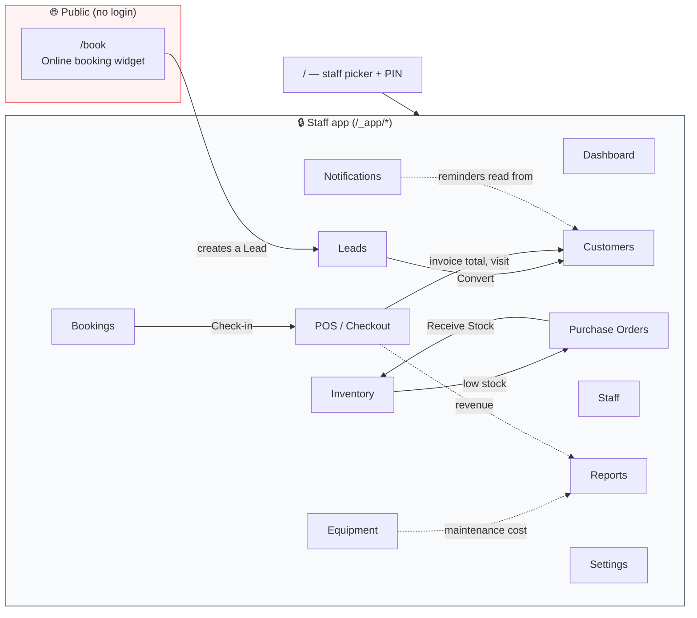
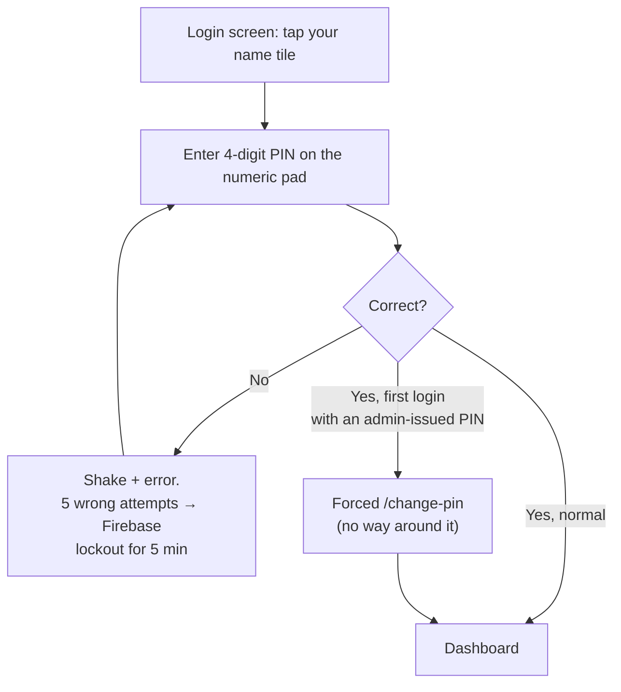
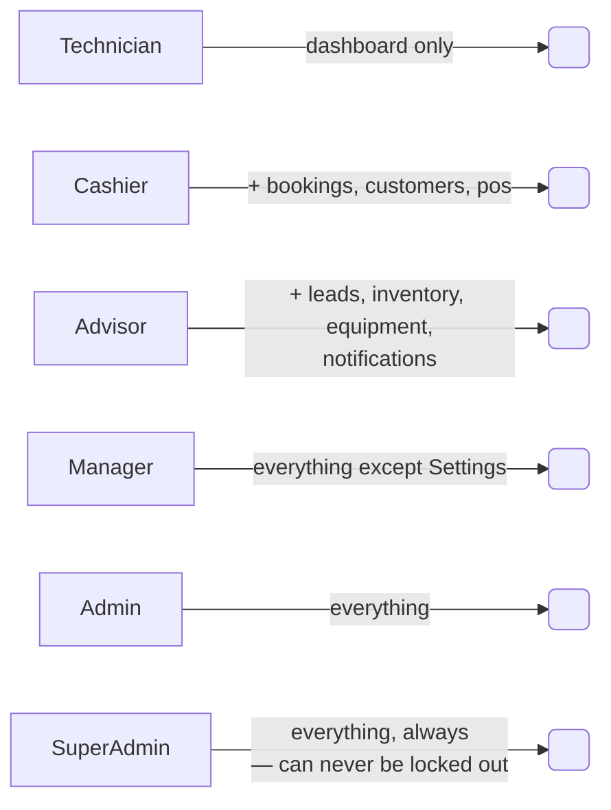
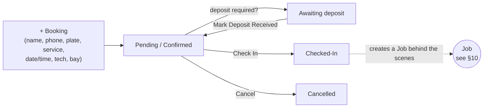
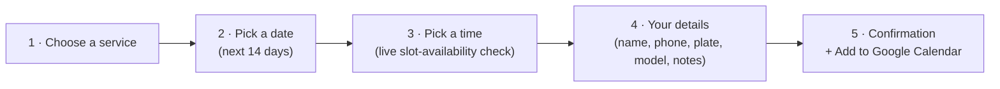
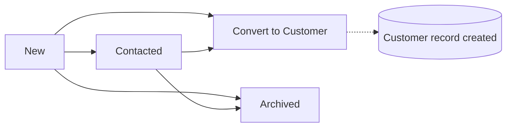
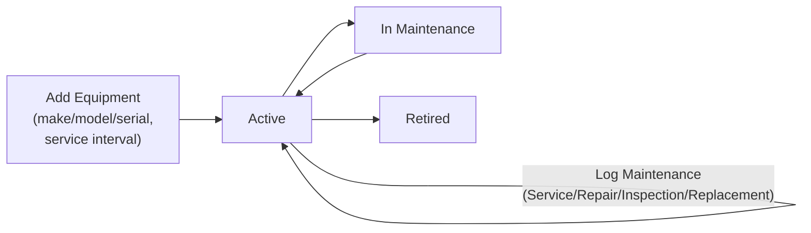
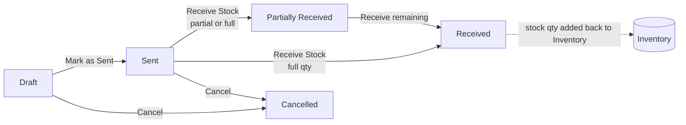
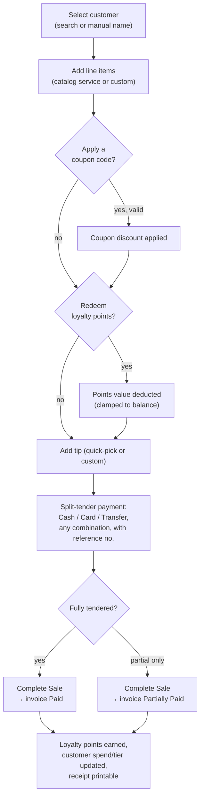
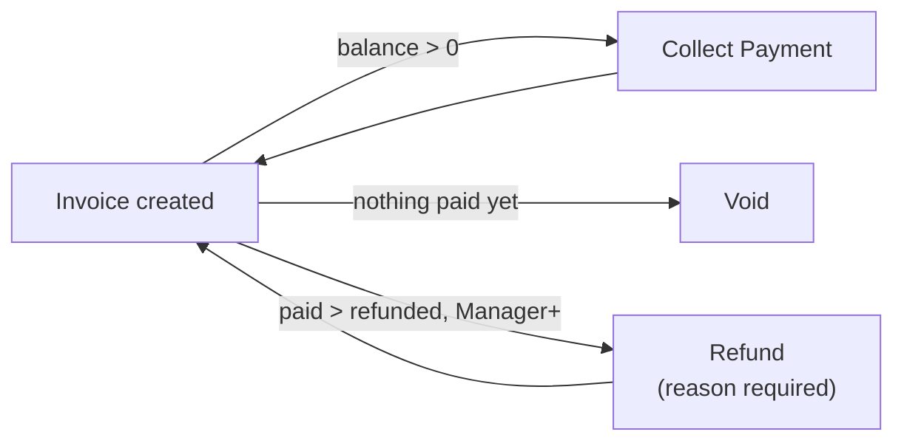

# Polish Station OS — Full Feature Map

A complete tour of everything the Polish Station point-of-sale / shop-management system does, module by module, with the flows between them.

> **Stack:** TanStack Start (React) + Firebase (Firestore, Auth) · client-side auth, no server-hop on login · single-location car-detailing shop in Dehiwala, Sri Lanka (LKR).

---

## 1. System at a glance

Firestore is the single source of truth; every screen is a live listener, so every till in the shop sees changes from every other till in real time.

---

## 2. Signing in

- **No server round-trip** — the client signs in directly against Firebase Auth (`signInWithEmailAndPassword`) using a synthetic `username@staff.polishstation.internal` / PIN pair.
- The login screen is a **tap-your-face picker**, not a text field: staff tiles come live from the roster (name, role, colour avatar).
- A physical keyboard works too (hidden input trap captures digits).
- Every account carries a **role** (what you may *do*) and an explicit **module permission list** (what you may *see*) — see §4.
- Deactivating, deleting, or demoting a user **revokes their session immediately**, not just at next login.

---

## 3. Dashboard

The morning-briefing screen — everything below is read-only, live-updating.

- **KPI cards:** Revenue Today · Upcoming (today) · Outstanding balance.
- **Today's Timeline:** every job scheduled today, in time order, with live status chips.
- **Inventory Alerts:** anything at or below its reorder point, "Out"/"Low" flagged.
- Degrades gracefully — if the jobs listener fails, the timeline says so instead of silently showing "0 jobs."

---

## 4. Roles & permissions

Two independent axes, both carried in the Firebase ID-token claims:

| | What it controls |
|---|---|
| **Role** | What you're *allowed to do* — a hierarchy: `Technician < Cashier = Advisor < Manager < Admin < SuperAdmin` |
| **Permissions** | Which of the 12 modules you can *see* — an explicit per-user checklist a SuperAdmin sets |

- A **SuperAdmin always holds every module**, regardless of the checklist — this is a hard rule, not a default, so the last SuperAdmin can never lock the business out of user management.
- Manager+ gating shows up on money-sensitive actions specifically: **refunds, coupon create/edit/delete**.
- Admin+ manages the staff roster itself (Settings → Staff & Access).
- An Admin can only act on strictly-lower roles; a SuperAdmin can act on anyone but themself. Nobody can demote or deactivate the **last** SuperAdmin, assign a role above their own, or act on their own account from the admin panel.

**Settings → Staff & Access** lets an Admin/SuperAdmin:
- Add a user (name, username, role, colour, temporary 4-digit PIN, per-module checklist)
- Edit role / colour / module access
- Reset a user's PIN (forces them to pick a new one on next login)
- Activate / deactivate an account
- Permanently delete an account (frees the username for reuse)

---

## 5. Bookings

Calendar for the shop floor, in three views: **Day** (bay-by-bay grid), **Week**, and **List**.

- **New Booking sheet**, reachable from anywhere via the top-bar `+ Booking` button:
  - Type a **phone number** → auto-fills name/vehicle if that customer already exists.
  - Type a **plate** → looks up any existing customer with that plate on file and offers to autofill.
  - Or paste a **17-character VIN** → decodes it live against the NHTSA public VIN database for year/make/model.
  - Pick service, date, time (30-min slots, 08:00–18:00), technician, bay.
  - Optional deposit requirement + amount.
- **Overlapping bookings** in the same bay lay out side-by-side automatically instead of stacking on top of each other.
- Click any booking card to **Check In**, **Cancel**, **mark deposit received**, or **delete**.
- **Online Booking Widget** panel: gives you the public `/book` link and a copy-pasteable `<iframe>` embed snippet for your website.

### Public booking widget (`/book`, no login)

- Rate-limited and slot-checked server-side so two customers can't double-book the same slot.
- Can be embedded on the shop's own website via `?embed=true` (strips the header/chrome).

---

## 6. Customers

Full CRM: search/filter by name, phone, plate, or loyalty tier.

- **Customer record:** name, phone, email, unlimited vehicles (plate/model/colour), auto-computed **tier** (Bronze/Silver/Gold/Platinum by lifetime spend), visit count, lifetime spend, last visit, loyalty points.
- Expand any row to see: loyalty balance, vehicle list, last 5 invoices.
- **Per-customer data export** — one click downloads a JSON file with everything the business holds on that person (profile, vehicles, full invoice history).
- **Bulk CSV export** of the whole customer list.
- **Coupons panel** (same page): create/edit/enable/disable/delete promo codes — percent-off or fixed-amount, with an optional expiry date and redemption cap. Manager+ to manage; anyone can view.

---

## 7. Leads

Inbox for inbound interest that isn't a customer yet — contact-form submissions and booking-request inquiries.

- Filter by type (Contact vs Booking Request) and status.
- **Convert to Customer** checks for an existing match by email/phone first (won't create a duplicate) and pre-fills the new customer record from the lead's details.

---

## 8. Inventory

Stock control for detailing supplies.

- Item record: name, SKU, category, unit (L/kg/pc/kit…), current stock, reorder point, unit cost, supplier.
- **Inline stock adjustment widget** (+/− quantity right in the table row) — every adjustment is audit-logged.
- Live **stock-value** and **low/out-of-stock counters**.
- Status auto-computed: In Stock / Low Stock / Out of Stock, colour-coded.
- Feeds the Dashboard's Inventory Alerts panel and the Purchase Orders auto-generation feature.

---

## 9. Equipment maintenance log

Asset register for the shop's machines (polishers, steam cleaners, pressure washers, compressors, vacuums, lights, water-fed poles…).

- Every piece of equipment tracks a **service interval** in days; the app computes days-until-due (or days-overdue) from the last logged service.
- A red **"Service overdue"** banner surfaces anything past due, shop-wide.
- Full maintenance history per item: type, date, description, who performed it, cost.

---

## 10. Purchase Orders

Supplier ordering, tied directly to Inventory.

- **Create PO:** pick a supplier, add inventory line items (qty + unit cost pre-filled from the item's current reorder gap), notes, raised-by.
- **⚡ Auto PO:** one click groups every low-stock item by supplier and generates a draft PO per supplier automatically, sized to bring stock to 2× the reorder point.
- **Receive Stock** panel lets you enter partial receipt quantities per line — Inventory is updated immediately and the PO status reflects partial vs full receipt.
- **Download PDF** of any PO at any stage.
- Dashboard shows total LKR committed on all open (non-cancelled, non-received) POs.

---

## 11. Notifications & Reminders

Zero-cost customer outreach — no SMS/email provider, just pre-filled deep links.

- **Service Reminders tab:** any customer with no visit in N days (configurable) surfaces automatically. One click opens **WhatsApp** or an **SMS** app with a pre-filled, templated message; a live preview bubble shows exactly what will be sent. Marking it sent removes them from the list and logs the notification.
- **Templates & Settings tab:** edit the Service Reminder and Google Review Request message templates with variable placeholders (`{customerName}`, `{vehicle}`, `{plate}`, `{daysSinceVisit}`, `{reviewLink}`, `{serviceName}`), plus your Google Business review link and the reminder threshold (7–365 days).
- After every completed sale, the POS screen offers a one-click **"Send Review Request via WhatsApp"** prompt.

---

## 12. POS / Checkout — the core money screen

- **Customer picker** — search by name/phone/plate, or bill a walk-in manually by typed name.
- **Line items** — pull straight from the services catalog (pre-priced) or add a fully custom line; edit qty, unit price, and a per-line discount inline. Every input is clamped server-side sane (no negative totals, no NaN).
- **Coupons** — apply a code at checkout; validated live (active / not expired / redemption cap not hit).
- **Loyalty points** — redeem any amount up to the customer's balance, live-clamped so a stale balance can never over-redeem.
- **Split-tender payments** — any combination of Cash / Card / Transfer in one sale, each with its own reference number.
- **Tip** — quick-pick buttons or type your own.
- **Save Quotation** — download a PDF quote for a cart without charging it.
- **Recent Invoices** table (last 10), each row offering:
  - **Download PDF** receipt
  - **Collect** — take further payment on a partially-paid invoice
  - **Refund** *(Manager+)* — partial or full, **requires a typed reason**, confirmed before it fires
  - **Void** — only available before any money has been collected (once paid, you refund instead)

There is **deliberately no card-payment gateway integration** — every tender is recorded manually (Cash/Card/Transfer + optional reference), by explicit choice.

---

## 13. Staff

- **Staff directory** (read-only roster): name, role, colour avatar, username, shift hours.
- Admin+ gets a shortcut straight into **Settings → Staff & Access** for actual account management (create/edit/reset PIN/deactivate/delete — see §4).

---

## 14. Reports

Business intelligence, filterable by period (**Today / 7 days / 30 days / All time**), everything exportable to CSV.

| Report | What it shows |
|---|---|
| **Revenue Summary** | Total revenue, cash/card/transfer split, average invoice value |
| **Profit & Loss** | Real revenue minus real logged expenses, by category (no fabricated per-service margins — there's no cost-of-goods link to make that number honest) |
| **Booking Analytics** | Booking count, check-in count, no-show rate |
| **Customer Report** | Returning vs new customer split, retention % |
| **Customer Lifetime Value** | Every customer ranked by lifetime spend, with average order value |
| **Inventory Report** | Stock value on hand, low/out-of-stock counts |

Plus:
- **Daily Revenue chart** — stacked area chart (Cash/Card/Transfer) over the selected period.
- **Top Customers by Lifetime Value** table.

---

## 15. Settings

Admin-only control panel, organised into sections:

- **Business** — name, trading name, phone, email, address, hours (prints on every invoice/PO/PDF letterhead, shared live across every till).
- **Services Catalog** — add/edit/delete services with category, duration, and price — this is what populates the POS line-item picker and the public booking widget.
- **Bays & Capacity** — add/rename/remove the physical service bays bookings get assigned to; changes propagate everywhere instantly.
- **Booking Rules** — lead time, max advance booking, deposit threshold/percentage, cancellation window, no-show penalty, auto-confirm toggle.
- **Staff & Access** — see §4.
- **Notifications** — outbound channel toggles (local preference switches).
- **Integrations** — status display for Stripe Terminal / QuickBooks / Google Calendar / WhatsApp Business / Mailchimp (shown for visibility; live connection not wired up — deliberate scope decision, see §16).
- **Audit Log** — immutable, exportable record of every sale, booking, customer, coupon, service, inventory, equipment, purchase order, expense, and business/bay setting change: who, what, when.

---

## 16. Cross-cutting / always-available

- **⌘K / Ctrl+K global search** — jump straight to any customer, booking, or invoice from anywhere in the app.
- **Cash Out / Bank Deposit** (top bar, every screen) — log a till expense (categorised: Supplies/Fuel/Utilities/Maintenance/Staff/Other) or a bank deposit; feeds straight into the Profit & Loss report.
- **PDF generation** — Invoices, Purchase Orders, and Quotations all download as branded PDFs.
- **CSV export** — Customers, Revenue, P&L, Bookings, CLV, Inventory, and the Audit Log all export with RFC-4180-safe quoting and formula-injection guarding.
- **Low-stock → Auto PO** loop: Inventory flags low stock → Purchase Orders offers one-click auto-generation → Receiving stock writes straight back to Inventory.
- **Booking → Job** handoff: checking a booking in silently creates a **Job** — an internal work-tracking record with its own guarded status machine (`booked → arrived → checked_in → in_progress → qc → ready → delivered`, plus `cancelled`/`no_show`), which is what actually drives the Dashboard's live timeline. No screen currently exposes moving a job through these stages by hand — it's plumbing, not a user-facing kanban.

---

## 17. Deliberate scope decisions (not bugs — explicit choices)

| Decision | Reasoning |
|---|---|
| **Manual payments only, no payment gateway** | Explicit owner preference — every tender is typed in, none processed automatically |
| **No VAT/tax line** | Not modelled anywhere in the current schema — prices are entered VAT-inclusive if applicable |
| **WhatsApp/SMS via deep links, not a real provider** | Avoids a new account and per-message cost for a single-location shop |
| **No barcode scanning** | Explicitly excluded |
| **Single location, no multi-branch support** | Confirmed single-location business |
| **CSV export, not live QuickBooks/Xero sync** | Smaller scope, no external OAuth app needed |
| **No staff rota / shift scheduling UI** | Built once, later removed — not currently part of the app |
| **No per-service profit margin** | Would require a job→inventory-consumption link that doesn't exist; an invented number is worse than none |

---

## 18. Every screen at a glance

| Route | Who can see it | One-line purpose |
|---|---|---|
| `/` | Anyone (logged out) | Staff picker + PIN login |
| `/change-pin` | Any signed-in user with a forced PIN change | Mandatory PIN reset after an admin-issued temp PIN |
| `/book` | Public, no login | Customer-facing online booking widget (embeddable) |
| `/dashboard` | All staff (default module) | Today's KPIs, timeline, stock alerts |
| `/bookings` | Per permission | Day/Week/List calendar, check-in, deposits |
| `/customers` | Per permission | CRM + loyalty + coupons |
| `/leads` | Per permission | Inbound inquiry triage → customer conversion |
| `/inventory` | Per permission | Stock levels, adjustments, reorder points |
| `/equipment` | Per permission | Asset register + maintenance log |
| `/purchase-orders` | Per permission | Supplier ordering, receiving |
| `/notifications` | Per permission | Service reminders, review requests, templates |
| `/pos` | Per permission | Checkout, payments, refunds, receipts |
| `/staff` | Per permission | Read-only roster (links to Settings for Admin+) |
| `/reports` | Per permission | Revenue, P&L, CLV, bookings, inventory BI |
| `/settings` | Admin+ only | Business config, catalog, bays, access control, audit log |
