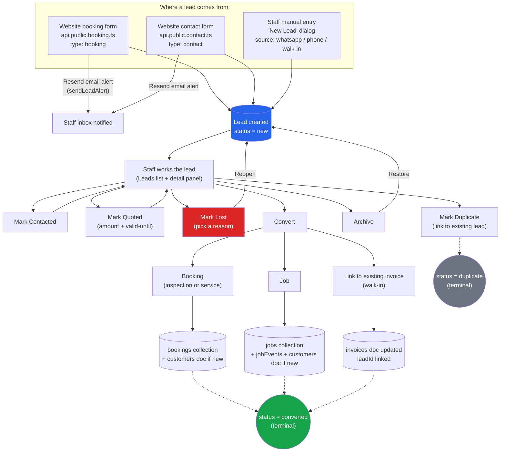
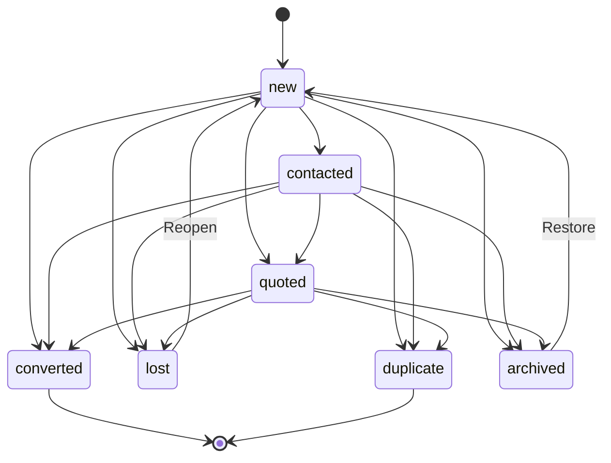
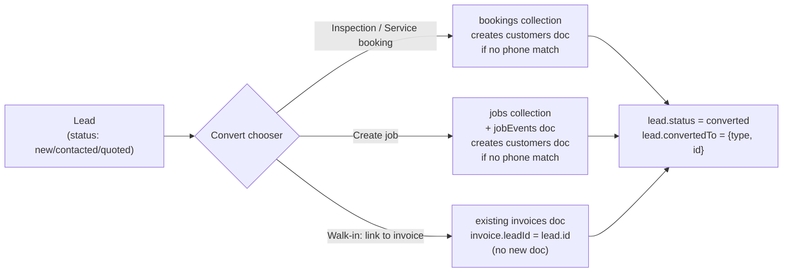
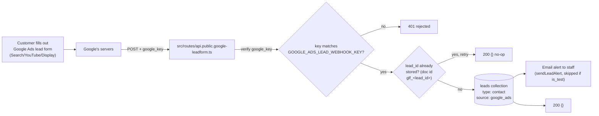

# Lead Lifecycle — How Leads Flow Through the POS

This documents the current (as-built) behavior, verified against source:
`src/lib/db.ts`, `src/lib/lead.ts`, `src/lib/store.tsx`, `src/routes/_app.leads.tsx`,
`src/routes/api.public.booking.ts`, `src/routes/api.public.contact.ts`, `firestore.rules`.

---

## 1. End-to-end flow (entry → outcome)

Every mutation (contact, quote, lose, duplicate, archive, convert) also writes a
**timeline event** to the `leadEvents` collection, shown in the lead's detail panel.

---

## 2. Status state machine

The exact allowed transitions, enforced in both the client (`lead.ts`) and
`firestore.rules` — a status jump not on this list is rejected:

**Note:** `contacted` is a dead end for "reopen" — once lost or archived, a lead can
only go back to `new`, not back to `contacted` or `quoted`. There's currently no way
to un-convert or un-duplicate a lead (by design — those are terminal).

---

## 3. Actions available on a lead (from the Leads page)

| Action | What it does | Where |
|---|---|---|
| **Mark Contacted** | `new`/etc. → `contacted` | Row action |
| **Mark Quoted** | Opens dialog for amount (LKR) + optional valid-until date → status `quoted` | `QuoteDialog` |
| **Mark Lost** | Requires picking a lost reason (see §4) → status `lost` | `LostDialog` / bulk `BulkLostDialog` |
| **Mark Duplicate** | Search + link to another open lead → status `duplicate` | `DuplicateDialog` |
| **Assign to staff** | Sets owner; single or bulk | Owner dropdown |
| **Archive** | → status `archived` (reversible via Restore) | Row action / bulk |
| **Edit fields** | Inline edit of name/phone/vehicle/service/etc. | `EditableFields` |
| **Add note** | Free-text note, logged only as a timeline event (not stored on the lead doc) | Detail panel |
| **Mark as Test** | Bulk-flags leads so they're excluded from metrics/counts | Bulk action |
| **WhatsApp quick-send** | Pre-written message templates, opens `wa.me` link — no status change | Detail panel |
| **Convert** | Opens chooser: Booking / Job / Link to invoice (see §5) | `ConvertChooserDialog` |

Every transition is gated by `isLegalLeadTransition()` — illegal actions simply
aren't shown as options in the UI.

---

## 4. Lost reasons

Fixed set (`LOST_REASONS`, `src/lib/db.ts`):

| Value | Label shown to staff |
|---|---|
| `price` | Price |
| `timing` | Timing didn't work |
| `distance` | Too far / distance |
| `no_response` | Customer stopped responding |
| `out_of_scope` | Out of scope for us |
| `duplicate` | Duplicate of another lead |

---

## 5. Quoting

- `QuoteDialog` collects **amount (LKR, required)** and an **optional valid-until date**.
- Confirming sets status → `quoted`, stamps `firstResponseAt` if this is the first
  response, and logs a timeline event like *"Quoted 25,000 · valid until 2026-09-20"*.
- **There is no separate accept/reject step.** A quoted lead just proceeds through
  the normal actions — either **Convert** (customer accepted) or **Mark Lost**
  (customer declined/ghosted). There's no standalone quote document.

---

## 6. Convert — three destinations

All three run inside a single Firestore transaction that re-checks the lead isn't
already converted (prevents double-conversion from concurrent clicks/tabs).

---

## 7. Filtering the Leads list

All filter state lives in the URL (shareable/bookmarkable):

- **Multi-select:** Status (all 7 values, defaults to `new` only), Service, Assigned staff (includes "Unassigned")
- **Single-select:** Source, Type (contact vs. booking)
- **Free text:** debounced search across name/email/phone/vehicle/notes
- **Date ranges:** Received date, Requested/preferred date
- **Toggle:** Show test leads (off by default)

---

## 8. Notifications / integrations today

- New leads from the **public website** (booking or contact form) trigger a Resend
  email to a configured staff inbox address. This is the *only* automated notification.
- **No automated SMS/WhatsApp** on lead creation or status change — WhatsApp is
  manual, staff-triggered template links only.
- **No CRM sync or outbound webhooks** exist for leads.

---

## 9. Channel expansion (2026-09-09)

### Google Ads Lead Form — shipped

New leads submitted through a Google Ads "Lead form" asset now flow straight
into the `leads` collection, same as website/manual leads.

- Implementation: [`src/routes/api.public.google-leadform.ts`](../src/routes/api.public.google-leadform.ts).
- Standard fields (`FULL_NAME`, `PHONE_NUMBER`, `EMAIL`) map to `name`/`phoneRaw`/`email`; any custom form questions get folded into `message`.
- Dedup: Google redelivers on any non-2xx response or timeout, so the lead is stored at a deterministic doc id (`glf_<lead_id>`) — a repeat delivery of a lead already stored is a silent no-op, never an overwrite of staff edits.
- Test leads sent via Google's "send test lead" button are stored with `isTest: true` and skip the email alert, same as the existing test-lead convention.
- Lands as `type: "contact"`, `source: "google_ads"` — shows up in the Leads list with a Google Ads label/icon and can be filtered like any other source.

**What you still need to do on Google's side** (I can't do this part — it needs your Google Ads account access):
1. Pick (or generate) a long random secret string and set it as `GOOGLE_ADS_LEAD_WEBHOOK_KEY` in the server's `.env`, then redeploy.
2. In Google Ads: **Assets → Lead form asset → Edit → Delivery options → Webhook integration**.
3. Webhook URL: `https://<your-production-domain>/api/public/google-leadform`
4. Webhook key: the same secret from step 1.
5. Click **Send test lead** — confirm it shows up in the Leads list (with `isTest` true, so it won't skew metrics) and delete it afterward.

### Google Business Profile messages — not currently possible

Google shut down the **Business Messages API** on 2024-07-31, and there's no
native replacement — as of 2026, Google Business Profile has no public API or
webhook for receiving the "message the business" chats customers send from
Search/Maps. There is nothing to integrate with; this isn't a POS limitation.

**Practical workaround**: point your Business Profile's messaging at a
channel this system (or a phone) actually receives into — e.g. add your
WhatsApp number as the profile's contact/chat link, so those conversations
land in the same manual WhatsApp lead flow (§4 above) staff already use.

Sources: [Update on Google Business Messages](https://developers.google.com/business-communications/business-messages/resources/release-notes/update-on-gbm), [Google Shuts Down Business Messages](https://www.partoo.co/en/blog/the-end-of-google-business-messages/).

### Still open from the original channel list

Facebook/Instagram Lead Ads, WhatsApp inbound automation, and call tracking are documented in the earlier conversation but not yet built — say the word if you want one of those next.

---

## Open questions for you

1. Should **quoted** leads have a real accept/reject flow (e.g. customer clicks a link) instead of relying on staff manually converting or losing them?
2. Should losing a `quoted` lead auto-suggest re-engaging after some days (follow-up reminder), since there's currently no scheduling/reminder step anywhere in the pipeline?
3. Is manual-entry lead source really limited to `whatsapp / phone / walk-in` — should there be an "referral" or "other" source?
4. Do you want SMS/WhatsApp auto-notify to staff (not just email) when a new website lead comes in?
